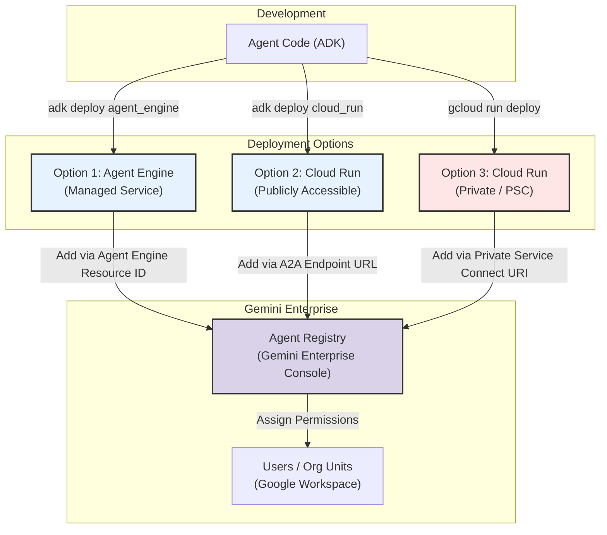
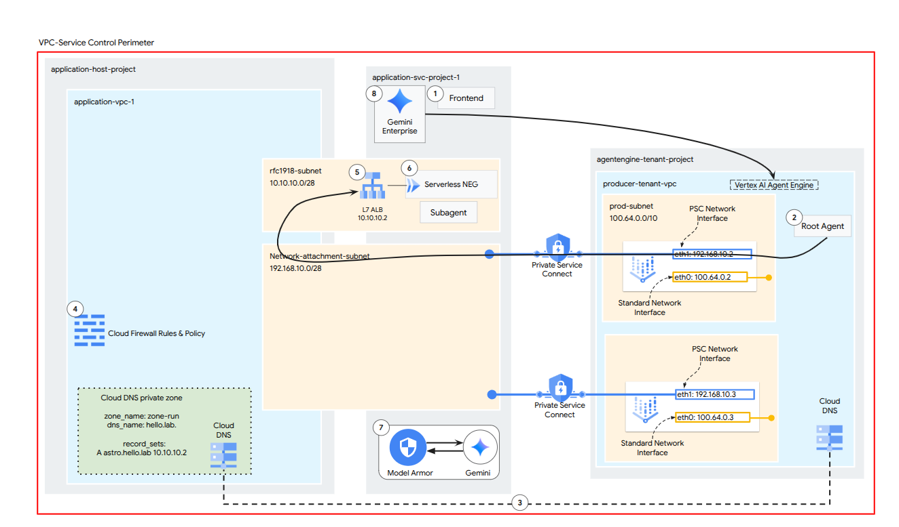

# Admin Guide: Deploying and Registering Your Agent

This guide covers how to deploy your ADK agent to **Vertex AI Agent Engine** and make it available in **Gemini Enterprise**.

## 1. Deploy to Agent Engine

The primary way to "register" your agent for use is to deploy it to the managed **Agent Engine** service. This creates a callable endpoint and an identity for your agent.

### Deployment Flow Diagram



### Command
Run the following command from your project root:

```bash
adk deploy agent_engine \
  --project YOUR_PROJECT_ID \
  --region us-central1 \
  --display_name "My First Agent"
```

### Important Flags
*   `--trace_to_cloud`: Enables Cloud Trace (highly recommended for debugging).
*   `--otel_to_cloud`: Enables OpenTelemetry logging.
*   `--env_file .env`: Loads your environment variables.

### Example with Logging Enabled

```bash
adk deploy agent_engine \
  --project my-gcp-project \
  --region us-central1 \
  --display_name "Production Agent" \
  --trace_to_cloud \
  --otel_to_cloud
```

## Option 2: Deploy to Cloud Run

Alternatively, you can deploy your agent as a standard containerized service on **Cloud Run**. This gives you more control over the infrastructure (concurrency, timeouts, distinct URLs).

### Command
```bash
adk deploy cloud_run \
  --project YOUR_PROJECT_ID \
  --region us-central1
```

### Important Flags
*   `--allow-unauthenticated`: **Recommended for easy integration**. This allows Google's servers to reach your agent.
    *   **Security Warning**: You *must* verify the `Authorization` header in your agent code (check the `aud` claim matches your service URL) to prevent unauthorized access.
*   `--env_file .env`: Load environment variables.

### Integration with Gemini Enterprise

1.  **Copy URL**: After deployment, copy the **Service URL** (e.g., `https://my-agent-xyz-uc.a.run.app`).
2.  **Add to Registry**:
    *   Go to **Gemini Enterprise** > **Agents** > **Add agent**.
    *   Select **Custom agent via A2A** (or **Custom Chat App**).
    *   **Endpoint URL**: Paste your Cloud Run Service URL.
    *   **Audience**: Enter your Cloud Run Service URL here as well. This tells Gemini to sign the token for *your* service.
3.  **Authentication**:
    *   Gemini will send a Google-signed ID Token in the `Authorization: Bearer <token>` header.
    *   Your agent code receives this. Ensure your ADK/code validates it.

## Option 3: Secure Cloud Run (No Public IP)

For highly secure environments requiring **no public IP**, you must use **Private Service Connect (PSC)**. This allows Gemini Enterprise to talk to your agent over Google's private network.



### 1. Network Prerequisites
You need specific subnets for the Internal Load Balancer (Envoy-based) and for PSC Source NAT.

```bash
# 1. Create Proxy-only subnet (Required for Envoy-based ILB)
gcloud compute networks subnets create proxy-only-subnet \
  --purpose=REGIONAL_MANAGED_PROXY \
  --role=ACTIVE \
  --region=us-central1 \
  --network=YOUR_VPC_NETWORK \
  --range=10.129.0.0/23

# 2. Create PSC NAT subnet (Required for Service Attachment)
gcloud compute networks subnets create psc-nat-subnet \
  --purpose=PRIVATE_SERVICE_CONNECT \
  --region=us-central1 \
  --network=YOUR_VPC_NETWORK \
  --range=10.130.0.0/24
```

### 2. Deploy Internal-Only Service
Use `gcloud` to deploy your agent, enforcing internal ingress only.

```bash
gcloud run deploy my-secure-agent \
  --source . \
  --region us-central1 \
  --ingress internal \
  --no-allow-unauthenticated
```

### 3. Configure Internal Load Balancer (ALB)
Since the Cloud Run service is internal, we must put an Internal Application Load Balancer in front of it.

```bash
# 1. Create Serverless Network Endpoint Group (NEG)
gcloud compute network-endpoint-groups create my-agent-neg \
  --region=us-central1 \
  --network-endpoint-type=serverless \
  --cloud-run-service=my-secure-agent

# 2. Create Backend Service & Add NEG
gcloud compute backend-services create my-agent-backend \
  --load-balancing-scheme=INTERNAL_MANAGED \
  --region=us-central1 \
  --protocol=HTTP

gcloud compute backend-services add-backend my-agent-backend \
  --network-endpoint-group=my-agent-neg \
  --network-endpoint-group-region=us-central1 \
  --region=us-central1

# 3. Create Routing Rules (URL Map & Proxy)
gcloud compute url-maps create my-agent-map \
  --default-service=my-agent-backend \
  --region=us-central1

gcloud compute target-http-proxies create my-agent-proxy \
  --url-map=my-agent-map \
  --region=us-central1

# 4. Create Forwarding Rule (The Internal VIP)
# NOTE: --subnet must be your MAIN subnet (where workloads run), NOT the proxy/psc subnet
gcloud compute forwarding-rules create my-agent-forwarding-rule \
  --load-balancing-scheme=INTERNAL_MANAGED \
  --network=YOUR_VPC_NETWORK \
  --subnet=YOUR_MAIN_SUBNET \
  --target-http-proxy=my-agent-proxy \
  --ports=80 \
  --region=us-central1
```

### 4. Create Service Attachment (PSC)
Now we expose that Internal Load Balancer via Private Service Connect so Gemini can reach it.

```bash
gcloud compute service-attachments create my-agent-psa \
  --region=us-central1 \
  --producer-forwarding-rule=my-agent-forwarding-rule \
  --connection-preference=ACCEPT_AUTOMATIC \
  --nat-subnets=psc-nat-subnet
```

### 5. Register with Gemini
1.  **Get the Service Attachment URI**:
    It will look like: `projects/YOUR_PROJECT/regions/us-central1/serviceAttachments/my-agent-psa`
2.  **Add to Gemini Enterprise**:
    *   When adding the agent, select **Custom agent via A2A**.
    *   For **Endpoint URL**, select **Private Service Connect**.
    *   Paste your **Service Attachment URI**.


---

## 2. Registering with Gemini Enterprise

*Note: If you used Option 2 or 3, see the specific integration steps above. This section primarily details the **Agent Engine** flow.*

Once deployed to Agent Engine, you must register your agent with the **Gemini Enterprise** platform to make it discoverable to users in your organization (e.g., in Gemini for Google Workspace).

### Steps to Add to Agent Registry

1.  **Navigate to Gemini Enterprise**:
    *   Go to the [Google Cloud Console](https://console.cloud.google.com/).
    *   Search for and select **Gemini Enterprise**.

2.  **Select Application**:
    *   Click on the specific **Gemini Enterprise App** where you want to add the agent.

3.  **Add Agent**:
    *   In the navigation menu, click **Agents**.
    *   Click the **Add agent** button.

4.  **Configure Custom Agent**:
    *   Select **Custom agent via Agent Engine** as the agent type.
    *   **Agent Name**: Enter the name users will see (e.g., "Company Knowledge Bot").
    *   **Description**: vital for the model to know *when* to call your agent. Be descriptive (e.g., "Answers questions about internal HR policies using the employee handbook").
    *   **Resource Path**: Paste the full **Reasoning Engine Resource ID** you got after deploying (e.g., `projects/YOUR_PROJECT/locations/us-central1/reasoningEngines/YOUR_AGENT_ID`).

5.  **Authorization (If required)**:
    *   If your agent accesses private data, you may need to configure an **OAuth Client ID** and redirect URIs as prompted.

6.  **Create**:
    *   Click **Create** to finish. Your agent is now registered.

## 3. Deployment: Assigning to Users

Registering the agent makes it *exist* in the system. To let people actually *use* it, you must assign permissions.

1.  **Locate Agent**:
    *   In the **Gemini Enterprise** console, go to **Agents**.
    *   Click on your newly created agent.

2.  **Manage Permissions**:
    *   Click on the **User permissions** tab.
    *   Click **Add user**.

3.  **Assign Access**:
    *   **Principal**: Enter the email of a user, a **Google Group** (recommended for teams), or "All users" (if public to org).
    *   **Role**: Select the appropriate role (typically **User** or **Gemini Enterprise User**) to grant chat access.

4.  **Verify**:
    *   Ask a user in that group to open Gemini (gemini.google.com).
    *   They should now see your agent listed under "@[AgentName]" or in the "G" menu.

## 4. Deployment Checklist

Before deploying, ensure:
*   [ ] You have run `adk web` locally to verify functionality.
*   [ ] You have set **Model Armor** policies (see `model_armor_setup.md`).
*   [ ] You have configured logging env vars (see `view_logs_guide.md`).
*   [ ] Your `requirements.txt` is up to date.
